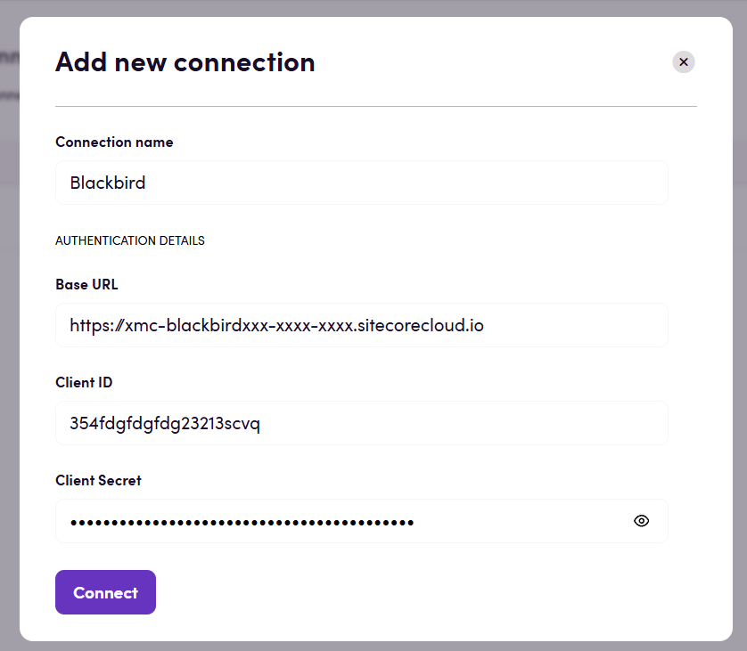

# Blackbird.io Sitecore (GraphQL)

Blackbird is the new automation backbone for the language technology industry. Blackbird provides enterprise-scale automation and orchestration with a simple no-code/low-code platform. Blackbird enables ambitious organizations to identify, vet and automate as many processes as possible. Not just localization workflows, but any business and IT process. This repository represents an application that is deployable on Blackbird and usable inside the workflow editor.

## Introduction

<!-- begin docs -->

Sitecore is one of the leading enterprise-level content management systems, enabling web content editors and marketers to have full control over all aspects of their websites — from social integration and blogs to personalization and ecommerce.

This application focuses on integrating Sitecore content, languages, and workflows into the **Blackbird automation environment** using **Sitecore GraphQL API**.

Unlike the previous generation, which required a custom plugin installation on your Sitecore instance, this app uses the **publicly available Sitecore GraphQL endpoint**, simplifying setup and maintenance.

For the legacy plugin-based version of this integration, see [Blackbird.io Sitecore XM Cloud (Plugin)](https://docs.blackbird.io/apps/sitecore-xm-cloud/).

## Requirements

Before setting up the connection, ensure the following:

- You are using **Sitecore version 10.3 or higher**.
- The **GraphQL API** feature is enabled for your Sitecore instance.
- You have a **Client ID** and **Client Secret** available from your XM Cloud credentials.
- You know your **Sitecore base URL** (e.g., `https://your-instance.sitecorecloud.io`).

## Enabling GraphQL API

This application interacts directly with your Sitecore instance via the built-in **GraphQL API**.

To enable and configure the GraphQL endpoint in your Sitecore environment, follow the official Sitecore guide:

➡️ [Set up Sitecore GraphQL API](https://doc.sitecore.com/xp/en/developers/93/sitecore-experience-manager/start-using-sitecore-graphql-api.html#set-up-sitecore-graphql)

To verify that the GraphQL API is configured properly, you can try to go to this page: https://your-instance.sitecorecloud.io/sitecore/api/authoring/graphql/ide/

If everything is set up correctly, you should see the GraphQL interface.

## Connecting

1. In the **Blackbird** interface, navigate to **Apps** and search for **Sitecore (GraphQL)**.
2. Click **Add Connection**.
3. Name your connection (e.g., `My Sitecore GraphQL connection`).
4. Provide the following parameters:
    - **Base URL** — your Sitecore instance URL (e.g., `https://your-instance.sitecorecloud.io`).
    - **Client ID** — from your XM Cloud credentials.
    - **Client Secret** — from your XM Cloud credentials.
5. Click **Connect** to establish the connection.

Once connected, you can begin using the available actions and events within your Blackbird workflows.

## Actions

### Content (items)

- **Search content**  
  Retrieve a list of Sitecore content items with pagination and language filtering.

- **Get content information**  
  Retrieve detailed information for a specific content item by its ID.

- **Download content**  
  Download the full content of a Sitecore item as an HTML file.  
  This allows further processing, translation, or storage in localization systems.

- **Upload content**  
  Upload translated or modified content back into Sitecore.  
  Supports both **HTML** and **XLIFF 2.0/2.1/2.2** formats.  
  If the specified version or language doesn’t exist, a new version is automatically created.

- **Delete content**  
  Permanently delete a Sitecore content item by its ID.

### Workflows

- **Search workflows**  
  Retrieve all configured workflows along with their states.  
  This includes workflow IDs, display names, and available transitions.

- **Update workflow state**  
  Change the workflow state of a specific content item.  
  Useful for automation scenarios such as moving items from “Ready for translation” to “In translation” or “Translation completed”.

## Events

### On content created or updated

A polling event that periodically checks for new or updated content items.  
When new or updated items are detected, they are returned as part of the event payload.

> **Important:**
> - Events are **polling-based**, not real-time.
> - Default polling interval: **5 minutes**.
> - You can configure the polling frequency in the UI.

## Feedback

Do you want to use this app or do you have feedback on our implementation? Reach out to us using the [established channels](https://www.blackbird.io/) or create an issue.

<!-- end docs -->
